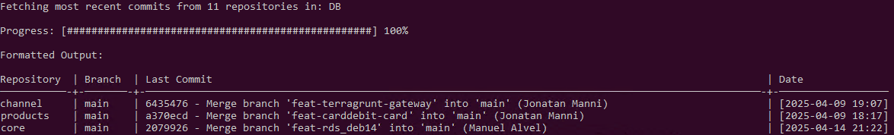

# 🕵️‍♂️ commit-tracer


**commit-tracer** is a Bash script for Linux that scans a given directory for Git repositories and retrieves the latest commit from each one. It's perfect for developers managing multiple repos who want a quick, readable overview of the latest activity.

> Originally created as `repo-info.sh`, installed globally as `commit-tracer` for convenience.

---

## 📸 Screenshots


> The image above shows the output of the script executed on a folder called DB.
---

## 🔧 Features

- ✅ Detects Git repositories in any given directory
- 🕒 Shows the latest commit from each repo
- 🔍 Filter by specific branches or exclude branches
- 📅 Sort commits by date (ascending or descending)
- 📊 Neatly formatted table with aligned columns
- ⏳ Includes a live progress bar

---

## 📦 Installation

Clone the repo and run the installer:

```bash
git clone https://github.com/nicocingo/commit-tracer.git
cd commit-tracer
chmod +x install-commit-tracer.sh
./install-commit-tracer.sh
```

This will install the script on ```/usr/local/bin ``` path.

## 🚀 Usage
```bash
Usage: commit-tracer [options] [directory]

Options:
  -s,  --sort             Sort output by date in ascending order
  -S,  --SORT             Sort output by date in descending order
  -fb, --filter-branch    Show only commits from the specified branch
  -eb, --exclude-branch   Exclude commits from the specified branch
  -h,  --help             Display this help message

If no directory is specified, the current directory is used.
```
---
## 📥 Examples
Display the list of parameters and useful information of the app:
```bash
commit-tracer -h
```
Basic scan of current directory:
```bash
commit-tracer
```
Scan a specific folder:
```bash
commit-tracer ~/repos
```
Show only commits from the main branch:
```bash
commit-tracer -fb main
```
Exclude all commits from the develop branch:
```bash
commit-tracer -eb develop
```
Sort by newest commits first:
```bash
commit-tracer -S
```
Combine filters and sorting:
```bash
commit-tracer -fb main -S ~/code
```
---
## ❌ Uninstallation
To remove commit-tracer from your system:

```bash
sudo rm /usr/local/bin/commit-tracer
```
